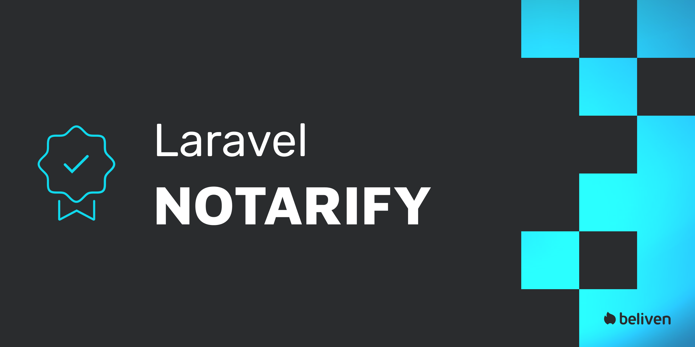

# Laravel Notarify

<br>
<p align="center"></p>
<br>
    
<p align="center">

[](https://packagist.org/packages/beliven-it/laravel-notarify)
[](https://github.com/beliven-it/laravel-notarify/actions?query=workflow%3Arun-tests+branch%3Amain)
[](https://github.com/beliven-it/laravel-notarify/actions?query=workflow%3A"Fix+PHP+code+style+issues"+branch%3Amain)
[](https://packagist.org/packages/beliven-it/laravel-notarify)

</p>

A laravel package to perform notarization through blockchain.

This package supports notarization on the following providers:

- [Scaling Parrots](https://www.scalingparrots.com/en/)
- [Iuscribo](https://www.iuscribo.io/)


## Installation

You can install the package via composer:

```bash
composer require beliven-it/laravel-notarify
```

You can publish the config file with:

```bash
php artisan vendor:publish --tag="notarify-config"
```

Set the ENV variables

```
NOTARIFY_SERVICE=scalingparrots
// NOTARIFY_SERVICE=iuscribo

// If you use Scaling Parrots
SCALING_PARROTS_ENDPOINT=
SCALING_PARROTS_USERNAME=
SCALING_PARROTS_PASSWORD=

// If you use Iuscribo
IUSCRIBO_ENDPOINT=
IUSCRIBO_USERNAME=
IUSCRIBO_PASSWORD=
IUSCRIBO_COMPANY==
```

## Usage

```php
<?php

use Beliven\Notarify\Facades\Notarify;

$notarization = Notarify::upload($item) // $item is a file
$notarization = Notarify::verify($item); // $item can be a file or a Notarization instance

// The returned value is an instance of Beliven\Notarify\Entities\Notarization::class, which has the following public methods:
$notarization->getId(); // Returns the Notarization ID
$notarization->getHash(); // Returns the Notarization Hash
$notarization->getTimestamp(); // Returns the Notarization timestamp as a Carbon instance (UTC Timezone)
$notarization->getExplorerUrls(); // Returns the Notarization explorer urls as indexed array
```

## Changelog

Please see [CHANGELOG](CHANGELOG.md) for more information on what has changed recently.

## Contributing

Please see [CONTRIBUTING](https://github.com/beliven-it/.github/blob/main/CONTRIBUTING.md) for details.

## Security Vulnerabilities

Please review [our security policy](../../security/policy) on how to report security vulnerabilities.

## Credits

- [Andrea Spadavecchia](https://github.com/beliven-andrea-spadavecchia)
- [All Contributors](../../contributors)

## License

The MIT License (MIT). Please see [License File](LICENSE.md) for more information.
